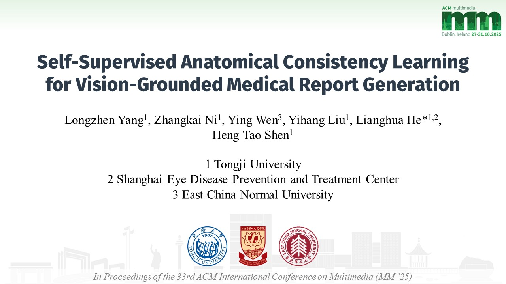
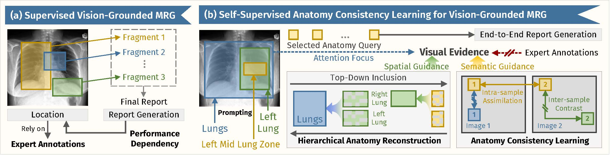
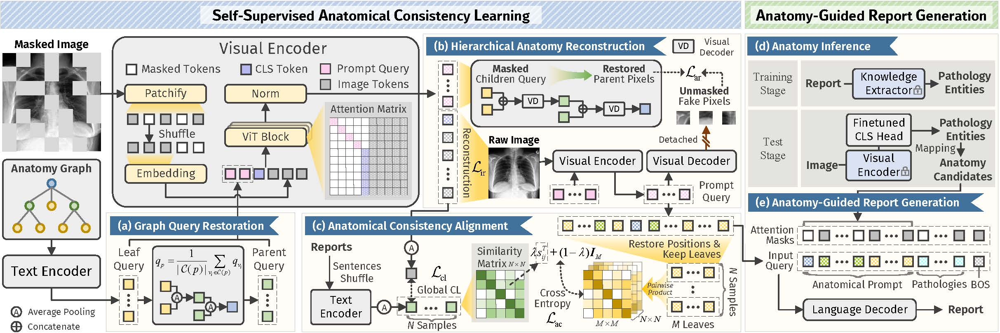

# SS-ACL

Official repository for **Self-Supervised Anatomical Consistency Learning for Vision-Grounded Medical Report Generation** (ACM MM 25', **Best Paper Candidate**). [Arxiv](https://arxiv.org/abs/2509.25963)

### 🎬 Presentation Video

<p align="center">
  <a href="https://www.youtube.com/watch?v=yADSjDHzuwI" target="_blank">
    
  </a>
</p>

> 🎥 Click the image above to watch the **SS-ACL demo video** (YouTube).

---

## 📰 News

- **2025-10 — Exiting News! Our paper has been nominated as one of the Best Paper Candidates !!**
- **2025-10 — v1.0.0 Release.** _Initial public release of code & pretrained model weights._
- **2025-07 — Our paper was accepted to the 33rd ACM International Conference on Multimedia (Dublin, Oct 27–31, 2025)!**

---

## 🧠 Overview

<p align="center">
  
</p>

**SS-ACL** is an annotation-free, vision-grounded medical report generation framework.  
It builds a **hierarchical anatomy graph** and learns **self-supervised anatomical consistency** so that generated reports are **spatially grounded** and **clinically precise** without expert bounding-box labels.

<p align="center">
  
</p>

**Core idea**:
- Use a **four-level hierarchical anatomy graph** (32 nodes; **25 leaf nodes** used as prompts) to encode top-down anatomical inclusion and guide attention to the correct regions.
- Enforce **hierarchical reconstruction** (global masked reconstruction + local region reconstruction) and **anatomical consistency alignment** (region-level contrastive learning with soft labels from textual similarity).
- Feed **anatomy queries + predicted pathology entities** to the language decoder with masked attention for accurate, anatomy-conditioned text generation.

---

## 📦 Datasets & Tasks

**Pretraining / Primary evaluation**
- **MIMIC-CXR** for end-to-end report generation (standard splits). The chest X-ray images are publicly available on [**PhysioNet**](https://physionet.org/content/mimic-cxr/2.0.0/),  
while the corresponding annotations can be downloaded via **Google Drive** (coming soon).

**Downstream vision & multimodal tasks**
- **Image Classification**: NIH ChestX-ray, RSNA Pneumonia (zero-shot / 1% / 10% / 100% fine-tuning).
- **Segmentation**: SIIM-ACR Pneumothorax (fine-tuning).
- **Phrase Grounding**: MS-CXR (zero-shot).
- **Image-to-Text Retrieval**: CheXpert 5x200 (zero-shot).

**Corresponding downstream data splits and annotations can be found in the `DownStreams/Datasplits` directory.** For more information, please refer to [`README.md`](DownStreams/Datasplits/READ_ME.md).

---

# Get Started

## 🛠️ Preparing

## ⚙️ Training


---

## 📊 Results


> See paper Tables and Figures for full comparisons and qualitative grounding maps.

---

## 🙏 Acknowledgements

We sincerely thank prior works for their valuable contributions to the community, which have enabled us to build our codebase upon their efforts, including [R2GenGPT](https://github.com/wang-zhanyu/R2GenGPT), [MaCo](https://github.com/SZUHvern/MaCo), and [MRM](https://github.com/RL4M/MRM-pytorch).

---

## 📚 Citation

If you find this work useful, please cite:

```bibtex
@inproceedings{he2025ssacl,
  title={Self-Supervised Anatomical Consistency Learning for Vision-Grounded Medical Report Generation},
  author={He, Lianghua and Zhang, Yilun and Li, Xinyu and Chen, Qian},
  booktitle={Proceedings of the IEEE/CVF Conference on Computer Vision and Pattern Recognition (CVPR)},
  year={2025}
}

